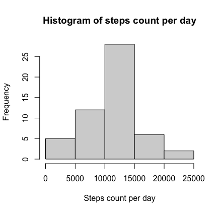
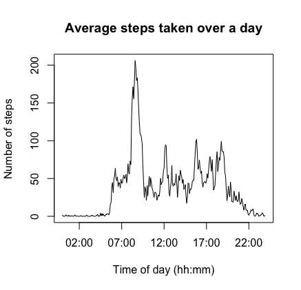
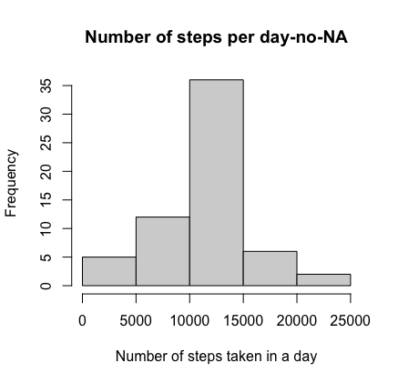
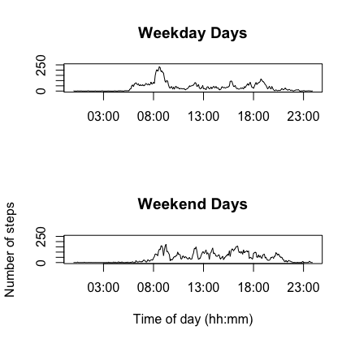

### Reproducible research assignment 

Load necessary packages


```r
library(knitr)
opts_chunk$set(echo =TRUE)
library(dplyr)
```

```
## 
## Attaching package: 'dplyr'
```

```
## The following objects are masked from 'package:stats':
## 
##     filter, lag
```

```
## The following objects are masked from 'package:base':
## 
##     intersect, setdiff, setequal, union
```


## Data cleaning and preparin for analyses
check directory and read in activity data


```r
getwd()
```

```
## [1] "/Users/olisza/Desktop/Coursera R/Reproducible research/reproducible_research"
```

Im my case my directory was set when I was creating the file for this assignment. I can read in data without showing directory.


```r
activity<-read.csv("activity.csv")
```

Check the data structure


```r
str(activity)
```

```
## 'data.frame':	17568 obs. of  3 variables:
##  $ steps   : int  NA NA NA NA NA NA NA NA NA NA ...
##  $ date    : chr  "2012-10-01" "2012-10-01" "2012-10-01" "2012-10-01" ...
##  $ interval: int  0 5 10 15 20 25 30 35 40 45 ...
```

I saw that date is not of a Date format, so I will change to be.


```r
activity$date<-as.Date(activity$date)
```

check interval variable


```r
head(activity$interval)
```

```
## [1]  0  5 10 15 20 25
```

Looking at values at the end of the day, we see its really an hour and minute identifier of the form ‘hhmm’. Let’s create an fixed-length character string, with leading 0’s for the early hours, that we can use for time-of-day analysis


```r
activity$hhmm <- sprintf("%04d", activity$interval)
head(activity$hhmm)  
```

```
## [1] "0000" "0005" "0010" "0015" "0020" "0025"
```

Add variable that tells if it is weekday or weekend


```r
library(lubridate)
```

```
## 
## Attaching package: 'lubridate'
```

```
## The following objects are masked from 'package:base':
## 
##     date, intersect, setdiff, union
```

```r
day_of_week <- wday(ymd(activity$date))
```

Create function to identify weekdays and weekends


```r
f <- function(i) {
  day_to_category <- c('weekend', 
                       'weekday', 
                       'weekday',
                       'weekday',
                       'weekday',
                       'weekday',
                       'weekend')
  
  return (day_to_category[i])
}

activity$time_of_week <- sapply(day_of_week, f)
head(activity$time_of_week)
```

```
## [1] "weekday" "weekday" "weekday" "weekday" "weekday" "weekday"
```

## Mean total number of steps per day

Sometimes your reprex uses packages that emit messages and warnings at startup (dplyr is a very common culprit). Use the code below to avoid it:


```r
suppressPackageStartupMessages(library(dplyr))
```

Create variable steps per day by grouping variables by date and summarizing steps


```r
steps_per_day <- activity %>% group_by(date) %>% summarise(steps = sum(steps))
```

```
## `summarise()` ungrouping output (override with `.groups` argument)
```

```r
head(steps_per_day)
```

```
## # A tibble: 6 x 2
##   date       steps
##   <date>     <int>
## 1 2012-10-01    NA
## 2 2012-10-02   126
## 3 2012-10-03 11352
## 4 2012-10-04 12116
## 5 2012-10-05 13294
## 6 2012-10-06 15420
```

Lets plot the results using histogram


```r
hist(steps_per_day$steps, xlab="Steps count per day", main="Histogram of steps count per day")
```



## Mean and median number of steps per day


```r
mean_steps_per_day<-mean(steps_per_day$steps, na.rm = TRUE)
median_steps_per_day<-median(steps_per_day$steps, na.rm = TRUE)
```

The mean number of steps was 


```
## [1] 10766.19
```

The median number of steps was


```
## [1] 10765
```

## Average daily activity pattern

Compute average 5 minute-interval pattern of daily steps


```r
steps_per_interval <- activity %>% group_by(hhmm) %>% summarise(steps = mean(steps, na.rm=TRUE))
```

```
## `summarise()` ungrouping output (override with `.groups` argument)
```

```r
head(steps_per_interval)
```

```
## # A tibble: 6 x 2
##   hhmm   steps
##   <chr>  <dbl>
## 1 0000  1.72  
## 2 0005  0.340 
## 3 0010  0.132 
## 4 0015  0.151 
## 5 0020  0.0755
## 6 0025  2.09
```

Plot average number of steps 


```r
plot(x = strptime(steps_per_interval$hhmm, format('%H%M')), 
     y = steps_per_interval$steps,
     type='l',
     main="Average steps taken over a day",
     xlab="Time of day (hh:mm)",
     ylab="Number of steps")
```




What was the maximum number of steps per day?

The maximum number of steps was:


```r
steps_per_interval[which.max(steps_per_interval$steps),]
```

```
## # A tibble: 1 x 2
##   hhmm  steps
##   <chr> <dbl>
## 1 0835   206.
```

## Data with missing values-how many missing values were in data

There was 


```r
number_of_rows <- nrow(activity)
number_of_nas  <-sum(!complete.cases(activity))
number_of_nas
```

```
## [1] 2304
```
missing values
 
To deal with missing values in data we will use the mean number of steps for that interval across all days whenever the reported number of steps will be NA. If the average number of steps in an interval over all days is NA, we will leave the original measurement as NA.

Assign new name to activity data to continue work on a new database


```r
activity2 <- activity
```

Get row numbers of NA measurements


```r
na_row_nums <- which(!complete.cases(activity2))
```

Replace NA for a given row number in the activity2 data set


```r
fix.na <- function(activityi) {
  
  intervali <- activity2[activityi,]$hhmm
  
  new_value <- steps_per_interval[which(steps_per_interval$hhmm == intervali),]$steps
  
  activity[activityi,]$steps <- new_value
}

activity2[na_row_nums,]$steps <- sapply(na_row_nums, fix.na)
summary(activity2$steps)
```

```
##    Min. 1st Qu.  Median    Mean 3rd Qu.    Max. 
##    0.00    0.00    0.00   37.38   27.00  806.00
```

Summary of the original activity data


```r
summary(activity$steps)
```

```
##    Min. 1st Qu.  Median    Mean 3rd Qu.    Max.    NA's 
##    0.00    0.00    0.00   37.38   12.00  806.00    2304
```

We can see that original activity data has NAs whereas activity2 does not have any NAs.

## Steps taken per day in a data without NAs

Sometimes your reprex uses packages that emit messages and warnings at startup (dplyr is a very common culprit). Use the code below to avoid it:

```r
suppressPackageStartupMessages(library(dplyr))
```

How many steps 


```r
steps_per_day2 <- activity2 %>% group_by(date) %>% summarise(steps = sum(steps))
```

```
## `summarise()` ungrouping output (override with `.groups` argument)
```

```r
head(steps_per_day2)
```

```
## # A tibble: 6 x 2
##   date        steps
##   <date>      <dbl>
## 1 2012-10-01 10766.
## 2 2012-10-02   126 
## 3 2012-10-03 11352 
## 4 2012-10-04 12116 
## 5 2012-10-05 13294 
## 6 2012-10-06 15420
```

Histogram of steps per day based on activity2


```r
hist(steps_per_day2$steps, 
     xlab = "Number of steps taken in a day",
     main = "Histogram of number of steps taken in a day with no-NA data set")
```



What is a mean and median number of steps in activity2


```r
mean_steps_per_day2 <- mean(steps_per_day2$steps)
mean_steps_per_day2
```

```
## [1] 10766.19
```

```r
median_steps_per_day2 <- median(steps_per_day2$steps)
median_steps_per_day2
```

```
## [1] 10766.19
```

## Are there differences in activity patterns between weekdays and weekends?

Calculate 5-minute interval of the number of steps taken-->
calculate number of steps every 5 minutes during week and weekend

weekdays 


```r
weekday_steps_per_interval <- activity %>% 
  filter(time_of_week == 'weekday') %>% 
  group_by(hhmm) %>% 
  summarise(steps = mean(steps, na.rm=TRUE))
```

```
## `summarise()` ungrouping output (override with `.groups` argument)
```

```r
summary(weekday_steps_per_interval)
```

```
##      hhmm               steps        
##  Length:288         Min.   :  0.000  
##  Class :character   1st Qu.:  2.218  
##  Mode  :character   Median : 23.974  
##                     Mean   : 35.338  
##                     3rd Qu.: 51.872  
##                     Max.   :234.103
```

weekends


```r
weekend_steps_per_interval <- activity %>% 
  filter(time_of_week == 'weekend') %>% 
  group_by(hhmm) %>% 
  summarise(steps = mean(steps, na.rm=TRUE))
```

```
## `summarise()` ungrouping output (override with `.groups` argument)
```

```r
summary(weekend_steps_per_interval)
```

```
##      hhmm               steps        
##  Length:288         Min.   :  0.000  
##  Class :character   1st Qu.:  1.107  
##  Mode  :character   Median : 32.036  
##                     Mean   : 43.078  
##                     3rd Qu.: 75.571  
##                     Max.   :175.000
```

Plot the weekend and weekday average activity in a panel plot


```r
par(mfrow=c(2,1))

plot(x = strptime(weekday_steps_per_interval$hhmm, format('%H%M')), 
     y = weekday_steps_per_interval$steps,
     type='l',
     main="Weekday Days",
     xlab="",
     ylab="",
     ylim=c(0,250))

plot(x = strptime(weekend_steps_per_interval$hhmm, format('%H%M')), 
     y = weekend_steps_per_interval$steps,
     type='l',
     main="Weekend Days",
     xlab="Time of day (hh:mm)",
     ylab="Number of steps",
     ylim=c(0,250))
```



There was small difference between step count between weekdays and weekends. The activity (number of steps) was higher during evening hours at the weekends but during weekdays the activity started before 8 am. Variations in activity was stable during weekends at 13:00-14:00 while during weekdays the activity during those hours dropped. Although there were differences in activity during weekdays and weekends, during all days of week the peak of step number was around 8am. 


